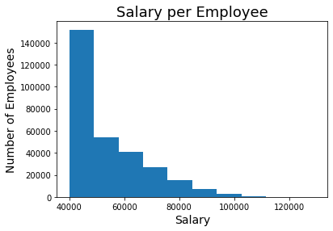
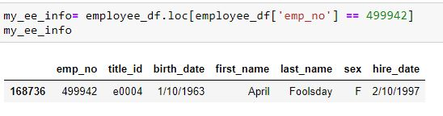

# SQL Challenge - Employee Database: A Mystery in Two Parts

As a recent employee with Pewlett Hackard, my first major task was a research project on employees from the 1980s and 1990s. The project included both Data Engineering and Data Analysis.

### I. Data Engineering
In order to perform this challenge, you first have to run the [schema.sql](EmployeeSQL/schema.sql) code. This was created with PostgreSQL version 11. All the csv files are in the Resources directory.
Below is the Entity Relationship Diagram or ERD for the tables created within the schema.

### II. Data Analysis
The following questions were answered using the [analysis.sql](EmployeeSQL/analysis.sql) file with screenshots of the sample data ouput.
#### 1. List the following details of each employee: employee number, last name, first name, sex, and salary.

#### 2. List first name, last name, and hire date for employees who were hired in 1986.

#### 3. List the manager of each department with the following information: department number, department name, the manager's employee number, last name, first name.

#### 4. List the department of each employee with the following information: employee number, last name, first name, and department name.

#### 5. List first name, last name, and sex for employees whose first name is "Hercules" and last names begin with "B."

#### 6. List all employees in the Sales department, including their employee number, last name, first name, and department name.

#### 7. List all employees in the Sales and Development departments, including their employee number, last name, first name, and department name.

#### 8. In descending order, list the frequency count of employee last names, i.e., how many employees share each last name.

### Bonus!
As I examined the data, I was overcome with a creeping suspicion that the dataset was fake. I surmised that my boss handed me spurious data in order to test the data engineering skills of a new employee. To confirm my hunch, I decided to take the following steps to generate a visualization of the data, to show my boss:

#### 1. Import the SQL database into Pandas.

The analysis code is in [Bonus.ipynb](EmployeeSQL/Bonus.ipynb).

#### 2. Create a histogram to visualize the most common salary ranges for employees.

#### 3. Create a bar chart of average salary by title.

#### Evidence in hand, I went to my boss's office and presented the visualizations. With a sly grin, my boss thanked me for my work. On the way out of the office, I heard the words, "Search your ID number." My employee ID number is 499942.

